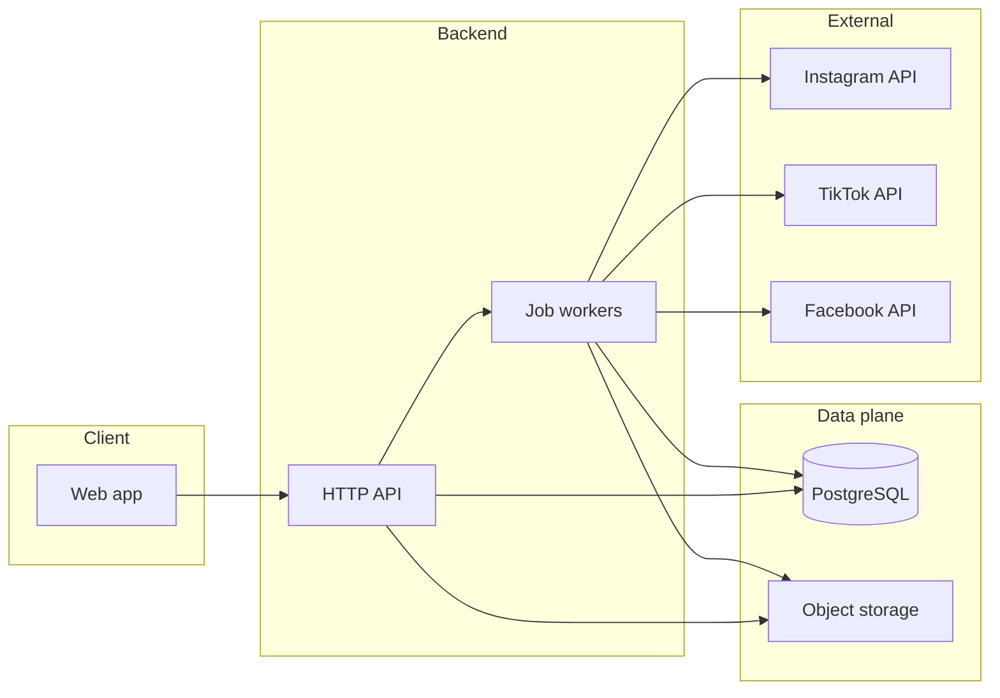

# Visiona — Architecture guide

This document describes how we intend to build Visiona: structure, technologies, and rationale. It is the engineering blueprint; update it when we make meaningful architectural decisions.

---

## Product anchor (source of truth)

The following paragraph is the **core product intent**. Features and technical choices should serve this:

> This project aims to build an app that lets users create content for Instagram, TikTok, and Facebook using a library of images or short videos they upload. The goal is for users to schedule content for their web presence in **few clicks** without spending much time. We may rely on **templates** to keep visual coherence across posts and **light filters** or color alignment so the feed feels **homogeneous**.

---

## High-level architecture

We favor a **modular monolith** first: one deployable backend with clear domain boundaries, splitting into services only when scale or team size demands it. The web app is the primary client; mobile apps are out of scope for the initial phase unless explicitly added later.



**Responsibilities**

- **Web app**: onboarding, media library, template picker, light editing (crop, filter preview), scheduling calendar, account linking.
- **API**: authentication, authorization, CRUD for assets and scheduled posts, validation, enqueue publish jobs.
- **Workers**: transcoding/thumbnails, color-normalization batch jobs, **publishing** at scheduled time with retries and idempotency.
- **PostgreSQL**: users, workspaces, social connections (tokens metadata), assets metadata, post templates, schedule queue state.
- **Object storage**: original uploads, derived renditions (thumbnails, platform-specific encodes if needed).

---

## Technology choices and rationale

| Layer | Choice | Why |
|--------|--------|-----|
| Web framework | **Next.js** (App Router) | Full-stack TypeScript, SEO-friendly marketing pages, API routes or BFF pattern, large ecosystem. |
| UI | **React** + **Tailwind CSS** (+ optional component primitives) | Fast iteration, consistent styling, good fit for dense dashboards and calendars. |
| API / server | **Next.js route handlers** or **tRPC** (decision TBD) | Type-safe client–server contracts reduce bugs; tRPC fits monolith well. Alternative: REST + OpenAPI if we need public third-party API early. |
| Database | **PostgreSQL** | Relational model fits schedules, accounts, and audit trails; strong consistency for “publish exactly once” logic. |
| ORM / migrations | **Drizzle** or **Prisma** (decision TBD) | Schema migrations, type-safe queries; pick one and standardize. |
| Auth | **Auth.js (NextAuth)** or hosted **Clerk** (decision TBD) | Social login may be required later; start simple, avoid building auth from scratch. |
| Object storage | **S3-compatible** (AWS S3, Cloudflare R2, MinIO locally) | Standard pattern for user media; R2 can reduce egress costs. |
| Background jobs | **BullMQ** + **Redis** or **Inngest** (decision TBD) | Scheduling and retries for publishing; Redis is ubiquitous; Inngest reduces ops for small teams. |
| Image processing | **sharp** (Node) | Server-side resize, format conversion, light adjustments. |
| Video processing | **ffmpeg** (worker container or sidecar) | Short clips: thumbnails, normalization, optional re-encode for platform specs. |
| Color coherence | **Pipeline TBD** | Options: preset LUTs, histogram matching, or simple tone curves per template—implement after MVP scheduling works. |
| Hosting | **Vercel** (web) + **managed Postgres/Redis** or **Docker** on a VPS | Align with Next.js; workers may need a separate process (e.g. Railway, Fly.io, ECS). |

**Non-goals for v0**

- Full non-linear video editor.
- AI generation of assets (can be a later phase).
- White-label multi-tenant enterprise features until core UX is proven.

---

## Repository structure (target)

We will use a **monorepo** (e.g. **pnpm** + **Turborepo**) when code lands; until then this section is the agreed target layout.

```text
visiona/
├── apps/
│   └── web/                 # Next.js application
├── packages/
│   ├── config/              # Shared ESLint, TSConfig, Tailwind preset
│   ├── db/                  # Schema, migrations, DB client
│   ├── ui/                  # Shared React components (optional)
│   └── validators/          # Zod schemas shared client/server
├── docs/
│   └── ARCHITECTURE.md      # This file
├── README.md
└── package.json             # Root workspace definition
```

**Domain modules (logical, inside `apps/web` or extracted later)**

- `auth` — sessions, OAuth for social platforms (separate from user login).
- `media` — upload, library, metadata, storage adapters.
- `templates` — layout definitions, brand presets, filter definitions.
- `scheduling` — calendar, timezone rules, recurrence (if ever needed).
- `publishing` — adapters per network, job state machine, failure handling.

---

## Cross-cutting concerns

- **Security**: encrypt token storage; least-privilege OAuth scopes; never log access tokens.
- **Observability**: structured logs, correlation IDs from web to workers; metrics on publish success/failure.
- **Compliance**: respect platform ToS and rate limits; surface clear errors when a network rejects a post.

---

## Phased delivery (engineering)

1. **Foundation**: monorepo, auth, Postgres, storage bucket, basic media upload + library UI.
2. **Templates & preview**: template engine, preview pipeline, optional filters/LUTs v1.
3. **Scheduling**: calendar UX, post drafts, queue persistence.
4. **Publishing**: one network first (e.g. Instagram or Facebook), then expand; retries and admin visibility.
5. **Polish**: color harmonization across assets, analytics hooks, performance hardening.

---

## Document maintenance

Update this file when we change stack choices, boundaries between services, or storage/job design. Purely visual tweaks to the web app do not require updates here.
